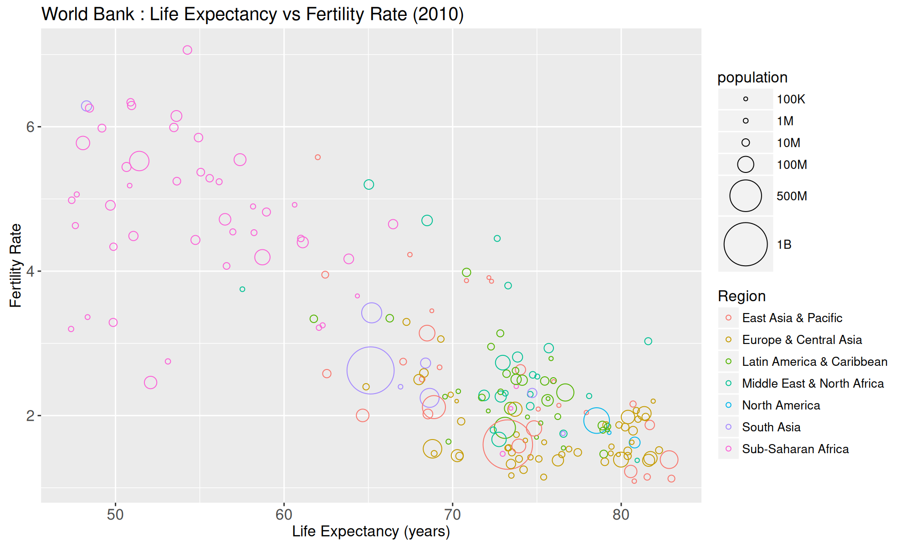

# Demographic Transition Visualization

## Description

This project was created to generate a static figure and an animated figure using R code. The animated figure visualizes the global demographic transition from 1960 to 2011 using World Bank data. Whereas, the static figure only focuses on the global demographic state in 2010.

## Figures 

1. 

*Scatter plot showing life expectancy vs fertility rate for countries in 2010, with point size representing population and color representing geographic region.*

2. 
  *Animated scatter plot from 1960 to 2011 with interactive year selection.*
 
## Code Files

- **[figure-worldBank-population-2010.R](figure-worldBank-population-2010.R)** - Code to generate the static figure.
- **[figure-worldBank-population.R](figure-worldBank-population.R)** - Code to generate an interactive animated version.

## Analysis

**Setting:** The goal of this visualization was to understand the relationship between life expectancy, fertility rate, and population size across different world regions from 1960 to 2011. By creating this figure, I aimed to visually test whether the demographic transition theory—which posits that countries move from high mortality/high fertility to low mortality/low fertility as they develop—holds true across diverse geographic regions.

**Hypothesis/Expectation:** I expected to see a strong negative correlation between life expectancy and fertility rate: as countries develop and people live longer, they tend to have fewer children. I anticipated that the largest population countries like China and India would be represented by the biggest circles, and that over the 50-year period, most countries would migrate toward higher life expectancy and lower fertility, with developed regions (Europe, North America) leading this transition and Sub-Saharan Africa showing slower progression.

**Interpretation:** The figure confirms this hypothesis clearly. By 2010, most regions demonstrate the predicted pattern: Europe & Central Asia and East Asia & Pacific achieved high life expectancy (70-80 years) and low fertility (1-2 children per woman), completing the demographic transition. Sub-Saharan Africa shows substantial improvement in life expectancy (moving from 40 to 55+ years) but maintains significantly higher fertility rates (3-6 children per woman) compared to other regions, indicating a slower and incomplete transition. The population-scaled circles effectively reveal that demographic giants like China and India successfully completed this transition despite their massive populations, while smaller countries show diverse trajectories depending on their region.

**Conclusion:** This visualization demonstrates that while the global demographic transition is a widespread phenomenon, Sub-Saharan Africa lags significantly in fertility decline despite achieving comparable improvements in life expectancy, suggesting that factors beyond mortality reduction—such as education, economic development, and cultural change—are necessary to complete the demographic transition.


## How to Run

### Prerequisites
```r
if(!requireNamespace("animint2"))install.packages("animint2")
```

### Execution
```r
# Generate the static figure
source("figure-worldBank-population-2010.R")

# Generate interactive animation
source("figure-worldBank-population.R")
```

## Acknowledgments
- Inspired by  Chapter 2 of the Animint2 Manual https://animint-manual-en.netlify.app/ch02/
